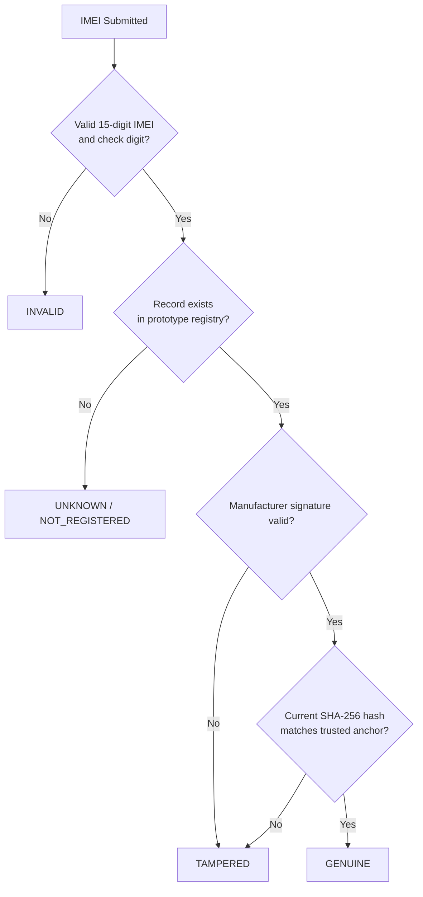
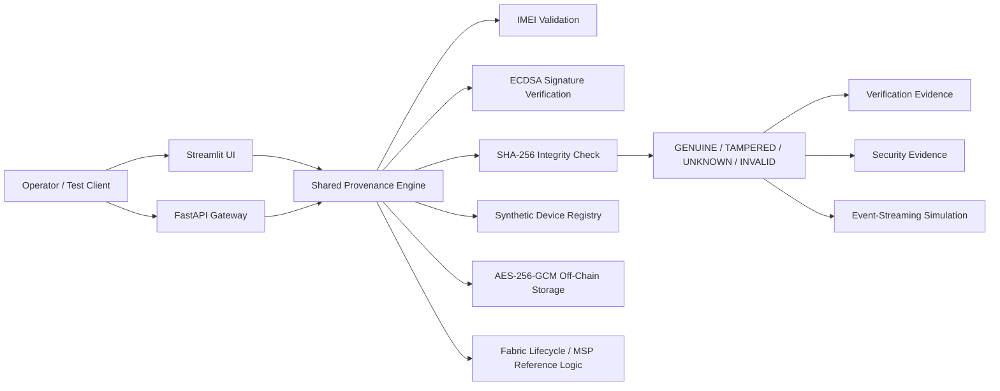

# 🔐 IMEI Provenance Blockchain

<div align="center">

## Blockchain-Based Device Provenance & Cryptographic Identity Verification

**Executable technical prototype for trusted IMEI provenance, cryptographic integrity, lifecycle control, and security-event evidence**


</div>

---

> [!IMPORTANT]
> **Scope:** This repository is an active technical prototype/reference implementation of the IMEI-provenance module. It demonstrates technical design, implementation progress, cryptographic verification, reproducible validation, and evidence generation. It is **not presented as a production carrier deployment**.

## 📚 Related Publication

This repository implements and demonstrates selected technical mechanisms from:

**Lakshmanaprakash Murugesan, “Securing the Link: A Blockchain-Based IMEI Provenance System for Telecom Security,” _Silicon Valleys Journal_, December 1, 2025.**

**Publication:**  
https://siliconvalleysjournal.com/2025/12/01/securing-the-link-a-blockchain-based-imei-provenance-system-for-telecom-security/

The publication provides the broader architecture for permissioned IMEI provenance, manufacturer identity, lifecycle tracking, custody controls, API integration, event streaming, encrypted off-chain records, tamper detection, and monitoring. This repository provides the **inspectable implementation layer** for selected mechanisms from that architecture.

---

## ✨ At a Glance

| Capability | Current prototype |
|---|---|
| IMEI validation | ✅ 15-digit + Luhn/check-digit validation |
| Four-state authenticity model | ✅ `GENUINE / TAMPERED / UNKNOWN / INVALID` |
| Hardcoded IMEI result rules | ✅ Removed |
| Manufacturer signature verification | ✅ ECDSA P-256 |
| Record integrity | ✅ SHA-256 comparison |
| Off-chain encryption | ✅ AES-256-GCM |
| Shared verification engine | ✅ API + dashboard |
| Lifecycle controls | ✅ Go chaincode/reference logic |
| MSP authorization concepts | ✅ OEM / Distributor / Carrier |
| Event streaming | ✅ Kafka-compatible simulation |
| Dashboard | ✅ Three-page Streamlit control tower |
| Evidence generation | ✅ CSV / JSON / XML |
| Python validation | ✅ 9 passed, 0 failed |

---

## 🧭 Navigation

- [Project Objective](#-project-objective)
- [Four-State Verification Model](#-four-state-verification-model)
- [System Architecture](#-system-architecture)
- [Implemented Components](#-implemented-components)
- [Streamlit Control Tower](#-streamlit-control-tower)
- [Lifecycle & Fabric Logic](#-lifecycle--fabric-logic)
- [Evidence & Validation](#-evidence--validation)
- [Quick Start](#-quick-start--windows)
- [Repository Structure](#-repository-structure)
- [Technical-Evidence Relevance](#-technical-evidence-relevance)

# 🎯 Project Objective

Telecommunications devices move through multiple organizations and lifecycle stages:

```text
Manufacturer
    ↓
Distributor
    ↓
Carrier
    ↓
Activation
    ↓
Blacklist / Service / Retirement
```

This prototype demonstrates a technical approach for answering four questions:

1. **Is the IMEI structurally valid?**
2. **Is the IMEI registered in the prototype provenance registry?**
3. **Does the record pass cryptographic verification?**
4. **Has the record been altered or otherwise failed an integrity check?**

The implementation combines IMEI validation, manufacturer-signature verification, SHA-256 record integrity, lifecycle-state logic, encrypted off-chain storage, API verification, evidence generation, and operator visualization.

# 🧠 Four-State Verification Model

The **IMEI value itself never determines the result**.



| Result | Meaning |
|---|---|
| 🟢 `GENUINE` | Registered record passes signature and integrity checks |
| 🔴 `TAMPERED` | Registered record fails signature and/or integrity validation |
| 🟡 `UNKNOWN` | Valid IMEI format, but no prototype registry record exists |
| ⚪ `INVALID` | IMEI structure/check digit is invalid |

> [!NOTE]
> Synthetic GENUINE and TAMPERED fixtures are generated by `scripts/seed_demo_registry.py`. They are **data fixtures**, not hardcoded classification rules.

# 🏗️ System Architecture



# ⚙️ Implemented Components

## 1. Shared Provenance Engine

**Path:** `provenance_engine/`

Both the API and dashboard use the same verification engine.

Implemented logic includes:

- IMEI structural validation;
- Luhn/check-digit validation;
- registry lookup;
- ECDSA P-256 signature verification;
- SHA-256 integrity comparison;
- four-state classification.

## 2. IMEI Validation

**Path:** `provenance_engine/imei.py`

```text
Exactly 15 digits
        +
Valid IMEI/Luhn check digit
```

```text
Malformed / bad check digit  → INVALID
Valid but not registered     → UNKNOWN
```

## 3. Manufacturer Signature Verification

**Path:** `provenance_engine/crypto.py`

Synthetic genesis records use **ECDSA P-256** signatures. The verification path loads the stored public key, reconstructs the signed payload, and verifies the signature.

A failed signature contributes to a `TAMPERED` classification.

## 4. SHA-256 Tamper Detection

**Path:** `provenance_engine/engine.py`

```text
Current device record
        ↓
Calculate SHA-256
        ↓
Compare with trusted anchor
```

| Condition | Outcome |
|---|---|
| Hash matches | Integrity check passes |
| Hash differs | `TAMPERED` |

## 5. AES-256-GCM Off-Chain Storage

**Path:** `offchain_storage/`

Implemented behavior:

- AES-256-GCM authenticated encryption;
- 256-bit key;
- fresh 96-bit nonce per encryption;
- encrypted-envelope persistence;
- restore/decryption workflow;
- SHA-256 content reference.

Local prototype keys are excluded from version control.

## 6. FastAPI Verification

**Path:** `api_gateway/`

```http
POST /api/v1/provenance/verify
```

Example:

```json
{
  "imei": "<15-digit test IMEI>",
  "requesting_msp": "CarrierMSP"
}
```

The endpoint calls the same `ProvenanceEngine` used by Streamlit.

# 🖥️ Streamlit Control Tower

**Path:** `dashboard/app.py`

## Page 1 — Asset Verification Tower

**Purpose:** Verify one IMEI and display its provenance result.

Displays:

- authenticity state;
- lifecycle state;
- owner/custody node;
- verification status;
- lifecycle/reference history.

Possible outcomes:

```text
GENUINE
TAMPERED
UNKNOWN
INVALID
```

## Page 2 — Network Verification & Operational Analytics

**Purpose:** Summarize evidence generated by verification activity.

Displays:

- completed verifications;
- Genuine count;
- Tampered count;
- validation/test pass rate;
- invalid-input attempts;
- application/API errors;
- recent verification records;
- event-stream simulation summary;
- aggregate security indicators.

Primary evidence:

```text
tests/test_log.csv
evidence/event_stream_log.csv
evidence/security_event_log.csv
```

## Page 3 — Security Threat Detection & Response

**Purpose:** Show the security interpretation of the current IMEI.

For `GENUINE`, the page shows a clear integrity-verification trace.

For `TAMPERED`, it shows:

```text
Verification ingress
        ↓
Simulated unauthorized modification condition
        ↓
Integrity mismatch
        ↓
Provenance validation failure
        ↓
Security action
        ↓
Audit record
        ↓
Containment handling
```

# ⛓️ Lifecycle & Fabric Logic

**Path:** `chaincode/imei/`

```text
REGISTERED
    ↓
DISTRIBUTOR_CUSTODY
    ↓
CARRIER_CUSTODY
    ↓
ACTIVATED
    ↓
BLACKLISTED
    ↓
DECOMMISSIONED
```

Implemented/reference capabilities include device registration, query, lifecycle updates, custody transfer, transition allow-lists, blacklist/decommission states, transaction/history concepts, and MSP-based authorization.

Reference MSPs:

```text
OEMMSP
DistributorMSP
CarrierMSP
OrdererMSP
```

> [!NOTE]
> The repository contains Fabric chaincode and configuration/reference material. The local Python prototype does not require a complete running Fabric peer/orderer/CA network.

# 📡 Event-Streaming Simulation

**Path:** `event_streaming/`

The project contains a **Kafka-compatible producer/consumer simulation**.

Runtime evidence is explicitly labeled:

```text
SIMULATED_EMIT
SIMULATED_PROCESS
SIMULATION_PASS
```

# 🧪 Evidence & Validation

## Automated Python Validation

Run:

```powershell
python run_validation.py
```

Current validation:

```text
9 passed, 0 failed
```

Generated outputs:

```text
evidence/pytest_console_output.txt
evidence/pytest_results.xml
evidence/validation_summary.md
```

The suite validates IMEI checking, four-state classification, ECDSA verification, SHA-256 tamper detection, AES-256-GCM encryption/decryption, off-chain persistence/restore, API/shared-engine consistency, event-stream simulation labels, and UNKNOWN-state handling.

## Four-State Execution Evidence

Outputs:

```text
tests/test_log.csv
evidence/event_stream_log.csv
evidence/security_event_log.csv
evidence/sample_inputs/
evidence/sample_outputs/
```

| Expected | Observed | Test result |
|---|---|---|
| GENUINE | GENUINE | PASS |
| TAMPERED | TAMPERED | PASS |
| UNKNOWN | UNKNOWN | PASS |
| INVALID | INVALID | FAIL |

> [!TIP]
> `PASS` indicates a successfully completed provenance-verification test. Invalid input is correctly classified as INVALID, but the Streamlit runtime records input-validation attempts as FAIL in tests/test_log.csv.

## Test Log Schema

**File:** `tests/test_log.csv`

```text
run_date
run_time
imei
requesting_node
test_case
imei_result
current_status
current_owner
data_source
response_time_ms
streamlit_status
result
```

# 🗂️ Synthetic Test Registry

**Path:** `data/device_registry.json`

Regenerate controlled fixtures:

```powershell
python scripts\seed_demo_registry.py --reset
```

Current generated identifiers are written to:

```text
evidence/demo_test_values.json
```

Classification is derived from record state and cryptographic checks:

```text
Registered + valid signature + matching hash → GENUINE
Registered + signature/hash violation        → TAMPERED
Valid IMEI + no record                       → UNKNOWN
Malformed / bad check digit                  → INVALID
```

# 🚀 Quick Start — Windows

## 1. Install dependencies

```powershell
python -m pip install -r requirements.txt
```

## 2. Run validation

```powershell
python run_validation.py
```

Expected:

```text
9 passed
```

## 3. Start FastAPI

```powershell
python -m uvicorn api_gateway.main:app --host 127.0.0.1 --port 8000
```

Swagger:

```text
http://127.0.0.1:8000/docs
```

## 4. Start Streamlit

In a second PowerShell window:

```powershell
python -m streamlit run dashboard\app.py
```

Dashboard:

```text
http://localhost:8501
```

# 🐳 Docker

The included Docker configuration runs only:

- FastAPI gateway;
- Streamlit dashboard.

```powershell
docker compose up --build
```

Kafka and Hyperledger Fabric are not deployed by this Compose configuration.

# 📁 Repository Structure

```text
IMEI-Provenance-Blockchain/
│
├── api_gateway/            # FastAPI interface
├── chaincode/imei/         # Fabric Go lifecycle/reference logic
├── dashboard/              # Streamlit control tower
├── data/                   # Synthetic prototype registry
├── docs/                   # Architecture and implementation mapping
├── docker/                 # API/dashboard Dockerfiles
├── event_streaming/        # Kafka-compatible simulation
├── evidence/               # Validation and runtime evidence
├── models/                 # Domain/database models
├── network-config/         # Fabric reference configuration
├── offchain_storage/       # AES-256-GCM storage
├── provenance_engine/      # Shared IMEI/signature/hash engine
├── scripts/                # Fixture/evidence generators
├── tests/                  # Automated tests and runtime log
├── requirements.txt
├── run_validation.py
└── README.md
```

# 🧾 Implementation Traceability

| Technical mechanism | Primary implementation | Evidence |
|---|---|---|
| IMEI validation | `provenance_engine/imei.py` | Python tests |
| Four-state classification | `provenance_engine/engine.py` | `test_log.csv` |
| ECDSA signature verification | `provenance_engine/crypto.py` | automated tests |
| SHA-256 tamper detection | `provenance_engine/engine.py` | security evidence |
| AES-256-GCM storage | `offchain_storage/` | encryption tests |
| FastAPI verification | `api_gateway/` | API tests |
| Streamlit control tower | `dashboard/` | runtime evidence |
| Fabric lifecycle logic | `chaincode/imei/` | Go reference/tests |
| MSP/custody concepts | chaincode + `network-config/` | lifecycle tests |
| Event-stream integration | `event_streaming/` | simulated event log |
| Evidence generation | `scripts/` + dashboard | CSV / JSON / XML |

For the detailed publication-to-code mapping:

```text
docs/ARTICLE_IMPLEMENTATION_MAPPING.md
```

# 🧑‍⚖️ Technical-Evidence Relevance

This repository documents **technical implementation and continued development** of the IMEI-provenance portion of the proposed endeavor.

It provides inspectable artifacts including:

- executable source code;
- shared provenance-verification logic;
- cryptographic validation;
- lifecycle chaincode/reference logic;
- API and dashboard interfaces;
- generated input/output evidence;
- security/event logs;
- automated validation results;
- reproducible execution instructions.

The strongest use of this repository is to demonstrate that the IMEI-provenance architecture has progressed beyond a written concept into an **inspectable and executable technical prototype**.

# 📌 Validation References

Current validation:

```text
evidence/validation_summary.md
```

Architecture-to-code mapping:

```text
docs/ARTICLE_IMPLEMENTATION_MAPPING.md
```

Lifecycle and authorization rules:

```text
docs/LIFECYCLE_AND_AUTHORIZATION.md
```

# ✅ Summary

```text
IMEI validation
      ↓
Registry lookup
      ↓
ECDSA manufacturer-signature verification
      ↓
SHA-256 integrity comparison
      ↓
GENUINE / TAMPERED / UNKNOWN / INVALID
      ↓
API + Streamlit presentation
      ↓
Evidence and security-event generation
```

**IMEI Provenance Blockchain** demonstrates the implemented device-provenance verification, cryptographic-integrity, lifecycle-control, evidence-generation, and operator-interface mechanisms of the technical prototype.
